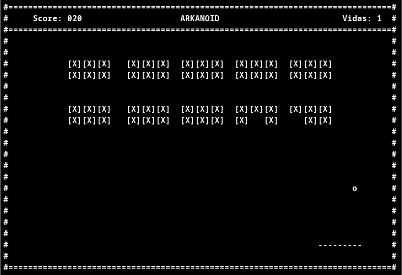
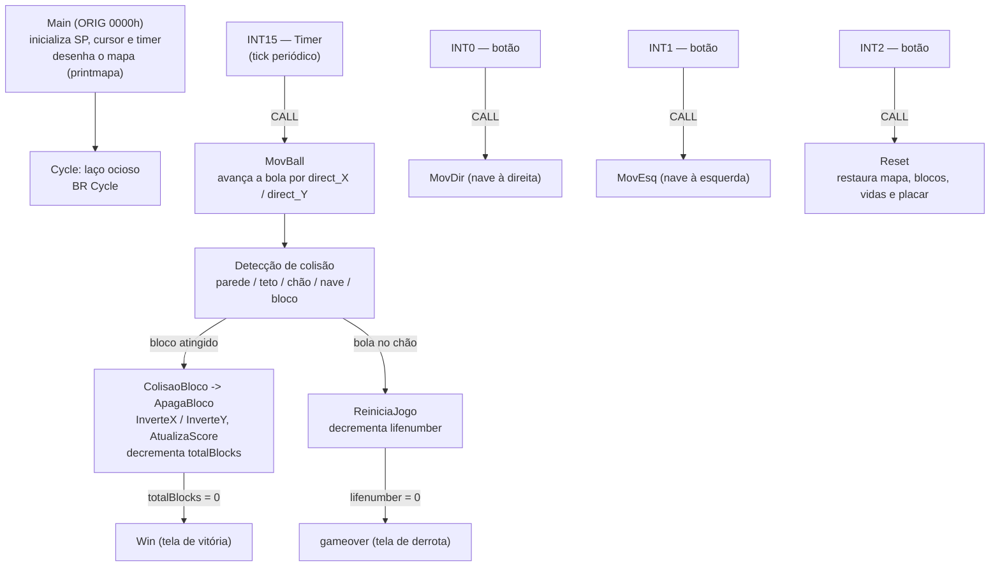

# Arkanoid em Assembly P3

Implementação do jogo Arkanoid (breakout) em Assembly do processador didático **P3**, com renderização em modo texto, física de colisão e controle 100% orientado a interrupções de hardware.


-orange)

<!-- TODO (opcional): trocar por um gif curto de ~5s mostrando a bola
     rebatendo e destruindo blocos, com a nave se movendo pelos botões
     de interrupção INT0/INT1 do simulador. -->



## Sobre o projeto

Este é o trabalho da disciplina de **Arquitetura de Computadores** (4º período de
Engenharia da Computação, CEFET/RJ). O objetivo era exercitar, num programa não
trivial, os conceitos de baixo nível do processador P3: modelo de registradores,
pilha, entrada/saída mapeada em memória e, principalmente, o mecanismo de
interrupções. O P3 é um processador didático de 16 bits (originado no Instituto
Superior Técnico de Lisboa) que acompanha um montador de linha de comando e um
simulador gráfico com tela de texto e botões de interrupção.

O programa reconstrói o Arkanoid inteiro — mapa, nave, bola, blocos, vidas e
placar — sobre uma tela de texto de 80×24 endereçada caractere a caractere.
A decisão central de arquitetura é que **nada acontece no laço principal**: depois
de inicializar a pilha, o cursor e o timer e desenhar o mapa, `Main` cai num laço
ocioso (`Cycle: BR Cycle`). Todo o jogo roda dentro de rotinas de interrupção — a
bola avança a cada tick do timer (INT15), a nave se move quando chega uma
interrupção de botão (INT0/INT1) e a partida reinicia por outra interrupção
(INT2). Isso mantém a taxa de movimento da bola desacoplada da velocidade de
execução do simulador e evita polling.

Outras decisões que valem nota: a **detecção de colisão com os blocos** trata
separadamente os casos vertical, horizontal e diagonal, calculando o endereço da
célula vizinha na memória de vídeo a partir de `linha0 + linha*81 + coluna` e
lendo o caractere que está lá (`[`, `X` ou `]`) antes de decidir como refletir a
bola e qual trio de caracteres apagar; a **reflexão** é feita apenas negando
(`NEG`) as componentes de direção `direct_X`/`direct_Y`; o **placar** é mantido
como um único inteiro e convertido para 3 dígitos decimais na hora de exibir,
usando `DIV` por 100 e por 10 para extrair centena, dezena e unidade e somando
`'0'` (48) para obter o ASCII; e a condição de vitória é rastreada por um
contador `totalBlocks` decrementado a cada bloco destruído. Toda a saída passa por
duas sub-rotinas reutilizáveis, `printchar` (um caractere numa posição) e
`printf` (uma string terminada em `@`), que escrevem na I/O mapeada em memória.

## Tecnologias

Extraído do conteúdo do repositório (não há `package.json`, `pom.xml` ou similar —
o projeto é um único fonte Assembly mais o toolchain do P3):

- **Assembly do P3** — linguagem do fonte (`trabalhoVinicius.as`): 16 bits,
  registradores `R0`–`R7` + `SP`, I/O mapeada em memória, tabela de vetores de
  interrupção.
- **p3as** (`p3as-linux`, v1.3) — montador de linha de comando. Binário ELF
  32-bit i386, estático. Gera o objeto (`.exe`) e o arquivo de referências
  (`.lis`).
- **P3 Simulator** (`p3sim.jar`) — simulador gráfico em Java
  (`pt.ulisboa.tecnico.iac`), com tela de texto e botões de interrupção. Requer
  uma JRE.
- **Git** — controle de versão.

## Como rodar localmente

### Pré-requisitos

- **Java** (JRE 8+) para executar `p3sim.jar`.
- **Linux com suporte a binários 32 bits**, porque `p3as-linux` é um ELF i386.
  Em distribuições 64 bits, instale as bibliotecas 32 bits:
  - Arch/Manjaro: `sudo pacman -S lib32-glibc`
  - Debian/Ubuntu: `sudo dpkg --add-architecture i386 && sudo apt update && sudo apt install libc6:i386`
- **Git**.

Não há variáveis de ambiente a configurar.

### Passos

```bash
# 1. Clonar
git clone git@github.com:vini3006/Arkanoid.git
cd Arkanoid

# 2. Montar o fonte -> gera trabalhoVinicius.exe e trabalhoVinicius.lis
./p3as-linux trabalhoVinicius.as

# 3. Abrir o simulador
java -jar p3sim.jar
```

No simulador:

1. Carregue o objeto `trabalhoVinicius.exe` (menu de abrir/carregar arquivo).
2. Dê *reset* e inicie a execução (*run*).
3. A janela de texto mostra o mapa do jogo. Use os **botões de interrupção** do
   simulador para jogar:
   - **INT0** — move a nave para a direita
   - **INT1** — move a nave para a esquerda
   - **INT2** — reinicia a partida (após `GAMEOVER` ou vitória)

O objeto já versionado (`trabalhoVinicius.exe`) permite pular o passo 2 e carregar
direto no simulador.

## Arquitetura

O programa é um único fonte, mas dividido em regiões de memória bem definidas
(via `ORIG`) e em sub-rotinas com responsabilidade única.

### Mapa de memória

| Região | Endereço | Conteúdo |
| --- | --- | --- |
| Código | `0000h` | `Main`, sub-rotinas e rotinas de interrupção |
| Dados | `8000h` | strings do mapa (`linha0`…`linha23`, telas de fim de jogo) e variáveis de estado (`bola_linha`, `bola_coluna`, `direct_X`, `direct_Y`, `nave_pos`, `gamestate`, `lifenumber`, `ScoreTotal`, `totalBlocks`, …) |
| Pilha | topo em `FDFFh` | `INITIAL_SP` |
| Vetores de interrupção | `FE00h` | `INT0`→`MovDir`, `INT1`→`MovEsq`, `INT2`→`Reset`, `INT15`→`Timer` |
| I/O mapeada em memória | `FFF6h`–`FFFFh` | `TIMER_UNIT`, `ACTIVATE_TIME`, `CURSOR`, `WRITE` |

A escrita na tela é feita posicionando o cursor (`M[CURSOR] = linha<<8 | coluna`)
e depois escrevendo o caractere em `M[WRITE]`.

### Fluxo de controle



### Sub-rotinas principais

- **Renderização:** `printchar`, `printf`, `printmapa`
- **Física da bola:** `MovBall`, `InverteX`, `InverteY`
- **Colisão com blocos:** `ColisaoBloco`, `ApagaBloco` (casos vertical, horizontal
  e diagonal)
- **Nave:** `MovDir`, `MovEsq` (com limites nas paredes)
- **Estado de jogo:** `ReiniciaJogo`, `Win`, `Reset`, `ResetBlocos`,
  `AtualizaScore`
- **Timer:** `ConfigurarTimer`, `Timer` (desliga-se sozinho em `GAMEOVER`)

## Estrutura de pastas

```
.
├── trabalhoVinicius.as    # fonte em Assembly P3
├── trabalhoVinicius.exe   # objeto montado (carregável no simulador)
├── trabalhoVinicius.lis   # tabela de referências gerada pelo montador
├── p3as-linux             # montador P3 (ELF 32-bit i386)
└── p3sim.jar              # simulador P3 (Java)
```

## Licença

Sem licença definida. Projeto acadêmico, publicado como portfólio.
